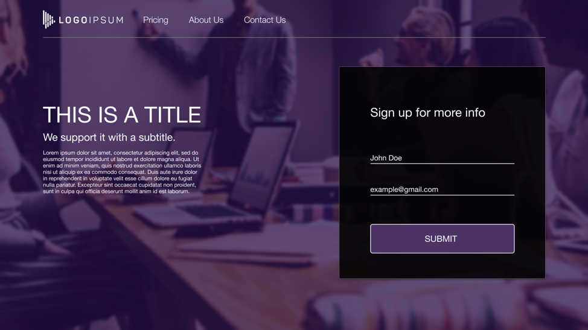

# Internal Web Assesment Project

The following mock-up of a new web page has been provided to you.

[Link to interactive site](https://www.figma.com/file/k8zWIxzT6xfPkdLmHRPlSk/LogoIpsum-Mockup)

It is your task to convert this mock-up to a web page that uses HTML, CSS, and Javascript.

`All required assets are included in the sandbox, located under: '/assets/...'`

---

The coding enviroment provided is based on VSCode and provides you with autocomplete and code linting to help you complete the task.

You may utalize Bootstrap 4's Grid Framework to help implement a responsive UI. You may utalize the following document to better help you.

[Bootstrap Grid Documentation](https://getbootstrap.com/docs/4.0/layout/grid/)

_Other material are not permited however we encourage you to walk us through your thought process._

*Time allotted: 1 hour.*

Expected behaviors:
Part 1:
- [ ] Visitor wants to sign up for the company's newsletter.
- [ ] Visitor's information is validated, and can only be submitted if valid.
- [ ] Success message is displayed with the visitor's name.

Part 2:
- [ ] Page should be mobile responsive.

---

## Color Pallet
- Hero Image Overlay Color:  `#1d003e / rgb(29, 0, 62)`
- Sign Up Box Background Color:  `#000000 / rgb(0,0,0)`
- Submit Button:  `#4B3365 / rgb(75, 51, 101)`
